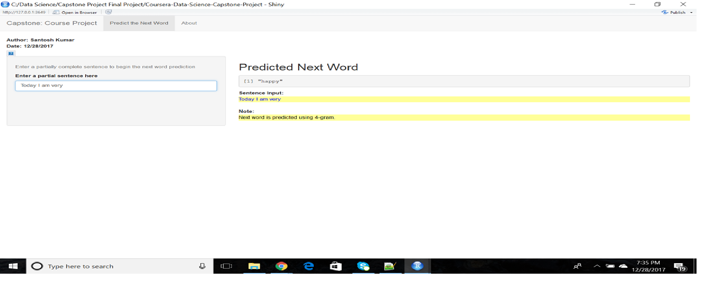

Capstone Course Project Final Presentation
========================================================
author:  Santosh Kumar
date: 28th December, 2017
autosize: true

Presenting application APP PREDICT which predicts next word using N-gram model.

APP PREDICT can be accessed and used with the following
link:https://santoshkn.shinyapps.io/Coursera-Data-Science-Capstone-Project/

THE PROJECT SUMMARY
========================================================

The final goal of the Data Science Capstone Project is to create a Shiny App product which applies prediction algorithm, based on an input of a word (or multiple words) and outputs a prediction of the next possible word.

The predictive model is based on the concept of n-gram sequence of words used in NLP (natural language processing).

This presentation highlights:

The description of the algorithm used to make the prediction.
Gives User instructions, and describes how the App functions.
The link on shinyapps.io where APP PREDICT is deployed abd can be accessed/tested.

ALGORITHM AND RELATED STEPS
========================================================

In the process of creating the APP PREDICT I went through the following steps:

Data loading, selecting US dataset (written in the English language) which contains Internet blogs, Internet news and Twitter messages.

Sampling 3 files & building Corpus using subsets of 3 files.

1. Text cleaning: tokenization, removing Stopwords, Stemming and Profanity filtering.
2. Building n-gram model, Creating 2 gram,3 gram and 4gram frequency matrices.
3. Building predictive model using n-gram frequency matrices.
4. Building APP PREDICT shiny App and Deploying it at shinyapps.io

THE SHINY APP & ITS USER INTERFACE
========================================================

USER INSTRUCTIONS & APP'S ALGORITM
========================================================

 INSTRUCTIONS FOR THE USER: USER NEEDS TO MAKE ONLY 2 STEPS:

Under the "Enter Your Word(s) in Below Box" title, the User types phrase/words in a input form.
User hits the blue "PREDICT" button which is placed just below the text entry box.
HOW THE ALGORITHM OF THE APP PREDICT WORKS:

The App cleans the input and tokenizes the words.
The entered word(s) are passed to the prediction algorithm.
Prediction function searches the N-gram dictionary for the top list of predicted words.
Suggested next word is displayed along with other prediction options & their likelihoods.
APP PREDICT can be accessed and used with the following link: https://aquilat.shinyapps.io/appredict

- Here is the APp link - https://santoshkn.shinyapps.io/Coursera-Data-Science-Capstone-Project/
- The code is available on [GitHub](https://github.com/santoshknxeno/Data-Science-Capstone-Project-FInal-Code.git)
